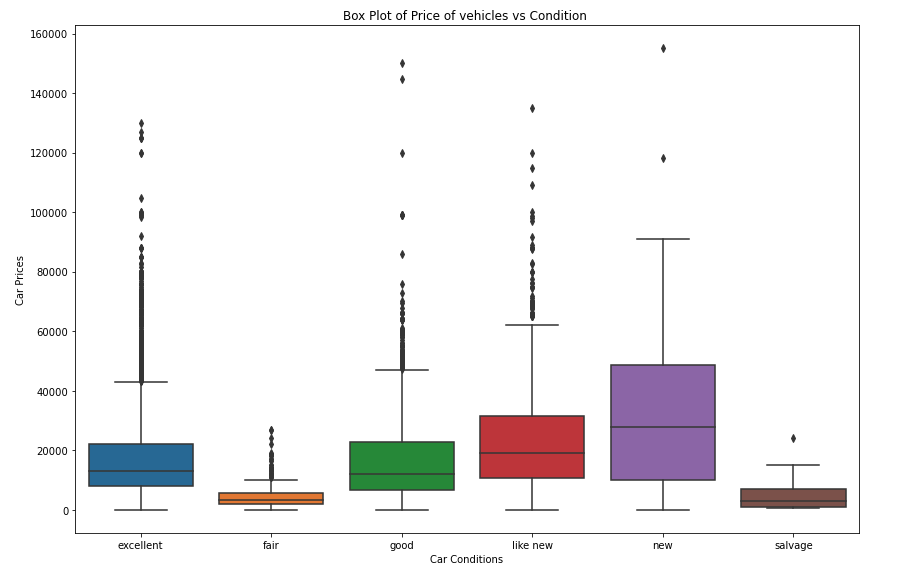
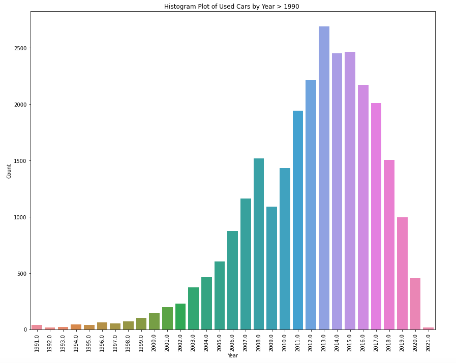
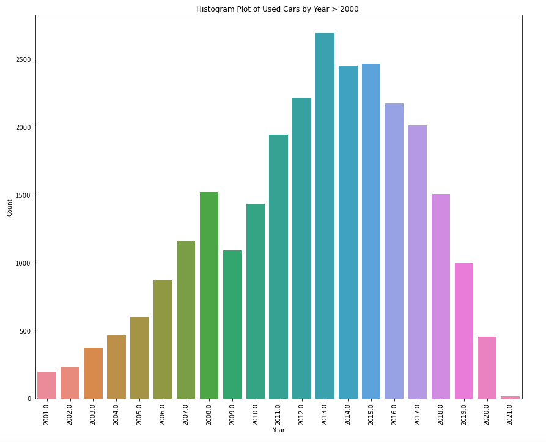

# priceofacar
GitHub Repository for work done on Professional Certificate in Machine Learning and Artificial Intelligence - December 2022

# Practical Application Assignment 11.1: What Drives the Price of a Car?

**Contents**

 * [Introduction](#Introduction)
 * [How to use the files in this repository?](#how-to-use-the-files-in-this-repository)
 * [Business Understanding](#Business-Understanding)
 * [Data Understanding](#Data-Understanding)
 * [Data Preparation](#Data-Preparation)
 * [Regression Model](#Regression-Model)
 * [Findings](#Findings)
 * [Next steps and Recommendations](#Next-steps-and-Recommendations)
 * [License](#license)
 
## Introduction

This repository contains the Jupyter Notebook for the Application Assignment 11.1. This takes a sample jupyter notebook to complete the exercise to analyse Kaggle used car data in [vehicles.csv](https://github.com/yemifalokun/priceofacar/blob/main/data/vehicles.csv) file in the data folder of this repository to determine the vehicles features like Fuel, Condition, Size, Type, Color etc. can be used to determine used car prices for the Car Dealership and Sales Team.

## How to use the files in this repository?

The notebooks are grouped into the following categories:
 * ``data`` – vehicles.csv data file from UCI Machine Learning repository used in the notebooks.
 * ``images`` – Image files used in Notebook and Project Description
 * ``notebook`` – What Drives the Price of a Car Notebook .

## Business Understanding

The business objective is to identify key features for used car prices based on the dataset provided so that Car Dealers and Sales People can use these key features to understand the cars that they need to have in their inventory to increase sales.

For this application, we used a machine learning process which starts with gathering the data, cleaning, preparing and manipulating the data, training the model then testing to get predicted values and measure model accuracy. As part of the life cycle, additional data from sales should be used on an on-going bases to “improve” the model which leads to higher prediction accuracy on the factors that  consumers are looking for in a used car. 

Source - https://centricconsulting.com/blog/machine-learning-a-quick-introduction-and-five-core-steps/

## Data Understanding

## Data Preparation

## Regression Models

## Findings

## Next Steps and Recommendations

As the data provided is not that clean with null, NAN, zero and unrealistic values, further filering of the data could be done, for example, selecting used car records with year => 2000. 

This should allow the model to use more of the newer car features like model, cylinders, drive, size which may have a greater influence on newer used car prices with lower odometer. This may also lead to a higher/better model accuracy (i.e., > 50%)

More and better data can be collected to train the model. This data should include the newer features on used cars like Automated Driving Safety Features, Infotainment, Cameras, Remote Start, Car Mileage which have an impact on used car prices.

Additional Data on used car datasets can be downloaded from [Kaggle Used Cars Datasets](https://www.kaggle.com/search?q=used+cars)

We would recommend some form of classification/categories for features like paint_color, state etc so that we can include them with fewer permutations in the model.

From the current models created, **Model6** and **Model7** would be the recommended models to use.  

These models were built with the following logic:
- **Model6** - Odometer and Price greater than 5000, Odometer, Year, fuel_diesel, drive_4wd  and size_full-size as the only inputs
- **Model7** - Odometer and Price greater than 5000, Odometer, Year > 1990, Year, fuel_diesel,  drive_4wd and size_full-size as the only inputs

These models  provided the following model feature selection:
- **Model6** - Diesel Fuel, Odometer, Four Wheel Drive, Full Size and Year
- **Model7** - Diesel Fuel, Year, Odometer, Four Wheel Drive and Full Size

For Next Steps, while the recommended models (i.e., **Model7** etc.) can be deployed, we would also recommend gathering more quality data that would produce a model with an accuracy of 75%+ based on used cars data no more than 10-15 years old.

## License

Open source projects are made available and contributed to under licenses that include terms that, for the protection of contributors, make clear that the projects are offered “as-is”, without warranty, and disclaiming liability for damages resulting from using the projects.
